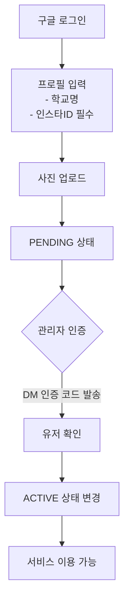
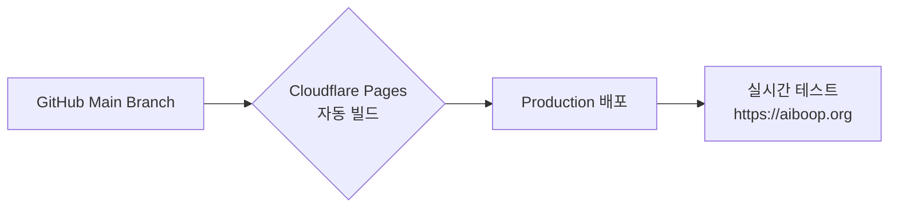

# 📱 [Master Spec] 이루리 소개팅 (Iluli Dating)  
**문서 버전**: `1.0.0` (Reborn: SOM Strategy & Manual Verification)  
**상태**: ✅ Production Ready  
**핵심 원칙**:  
> **"이 문서는 프로젝트의 유일한 진실 공급원(Source of Truth)입니다. 정의된 내용은 생략 없이 구현되어야 합니다."**

---

## 1. 시스템 개요 (System Overview)
### 1.1 프로젝트 정의
| 항목 | 내용 |
|------|------|
| **서비스명** | 이루리 소개팅 (Iluli Dating) |
| **핵심 가치** | 사진을 매개로 한 직관적인 매칭, 개인정보 노출 부담 없는 인스타그램 아이디 교환 |
| **시장 전략 (GTM)** | SOM (Serviceable Obtainable Market): **청주에 존재하는 대학교 재학생** (초기 거점) |
| **타겟 사용자** | 한국 거주 대학생 및 외국인 유학생 |

### 1.2 주요 기능
- **수동 인증**: 관리자가 인스타그램 DM으로 본인 확인 후 승인
- **듀얼 뷰**:  
  - **스와이프(Swipe) 모드**: Tinder 스타일 1:1 매칭  
  - **피드(Feed) 모드**: Instagram 스타일 그리드 탐색
- **인스타 연동**: 매칭 성사 시 상대방 인스타그램 ID 공개

### 1.3 배포 및 인프라
| 컴포넌트 | 구성 |
|----------|------|
| **Main URL** | https://aiboop.org |
| **Image URL** | https://photos.aiboop.org (R2 Custom Domain) |
| **Platform** | Cloudflare Pages + Workers (Edge Runtime) |
| **Database** | Cloudflare D1 (`iluli-db`) |
| **Storage** | Cloudflare R2 (`iluli-photos`) |

---

## 2. 데이터 모델 (Prisma Schema)
```prisma
datasource db {
  provider = "sqlite"
  url      = env("DATABASE_URL")
}

generator client {
  provider        = "prisma-client-js"
  previewFeatures = ["driverAdapters"]
}

enum Gender {
  MALE
  FEMALE
  OTHER
}

enum Role {
  USER
  ADMIN
}

enum UserStatus {
  PENDING // 가입 직후 (매칭 노출 불가)
  ACTIVE  // 관리자 인증 완료 (매칭 노출)
  BANNED  // 신고/차단됨
}

model User {
  id            String    @id @default(cuid())
  name          String?
  email         String?   @unique
  image         String?   // 구글 프로필 사진
  
  // 프로필 정보 (가입 시 입력)
  nickname      String?   @unique
  gender        Gender?
  school        String?   // 학교명 (직접 입력, 예: 청주대)
  instagramId   String?   // 필수 입력 (인증 및 매칭용)
  introduction  String?   // 자기소개
  
  role          Role       @default(USER)
  status        UserStatus @default(PENDING) // 기본값 대기
  
  // 관계
  accounts      Account[]
  sessions      Session[]
  photos        Photo[]
  sentLikes     Like[]    @relation("UserSentLikes")
  matchesAsUser1 Match[]  @relation("User1Matches")
  matchesAsUser2 Match[]  @relation("User2Matches")

  // 신고/차단
  reportsSent     Report[] @relation("Reporter")
  reportsReceived Report[] @relation("Reported")
  blocksSent      Block[]  @relation("Blocker")
  blocksReceived  Block[]  @relation("Blocked")

  createdAt     DateTime  @default(now())
  updatedAt     DateTime  @updatedAt

  @@index([email])
  @@index([gender])
  @@index([status]) // 매칭 쿼리 최적화
}

// 표준 NextAuth 모델 (Account, Session)
model Account { /* ... */ }
model Session { /* ... */ }

model Photo {
  id        String   @id @default(cuid())
  userId    String
  url       String   // R2 Public URL
  caption   String?
  order     Int      @default(0)
  user      User     @relation(fields: [userId], references: [id], onDelete: Cascade)
  createdAt DateTime @default(now())
}

model Like {
  id         String   @id @default(cuid())
  fromUserId String
  toUserId   String
  user       User     @relation("UserSentLikes", fields: [fromUserId], references: [id], onDelete: Cascade)
  createdAt  DateTime @default(now())
  @@unique([fromUserId, toUserId])
}

model Match {
  id        String   @id @default(cuid())
  user1Id   String
  user2Id   String
  user1     User     @relation("User1Matches", fields: [user1Id], references: [id], onDelete: Cascade)
  user2     User     @relation("User2Matches", fields: [user2Id], references: [id], onDelete: Cascade)
  createdAt DateTime @default(now())
  @@unique([user1Id, user2Id])
}

model Report {
  id          String   @id @default(cuid())
  reporterId  String
  reportedId  String
  reason      String   // 신고 사유
  details     String?  // 상세 내용
  reporter    User     @relation("Reporter", fields: [reporterId], references: [id])
  reported    User     @relation("Reported", fields: [reportedId], references: [id])
  createdAt   DateTime @default(now())
}

model Block {
  id          String   @id @default(cuid())
  blockerId   String
  blockedId   String
  blocker     User     @relation("Blocker", fields: [blockerId], references: [id])
  blocked     User     @relation("Blocked", fields: [blockedId], references: [id])
  createdAt   DateTime @default(now())
  @@unique([blockerId, blockedId])
}
```

---

## 3. 핵심 기능 명세 (Feature Specifications)
### 3.1 회원가입 및 인증 (Onboarding & Verification)


### 3.2 이미지 처리 (Image Handling)
| 정책 | 세부사항 |
|------|----------|
| **압축 정책** | 무압축 원본 업로드 (Zero Compression) |
| **파일 제한** | 10MB (클라이언트/서버 이중 체크) |
| **지원 포맷** | JPG, PNG, GIF, WEBP, AVIF, JXL, HEIC |
| **업로드 방식** | Presigned URL Direct Upload (R2) |

### 3.3 매칭 시스템 (Matching & Feed)
#### 🔹 접근 조건
- **ACTIVE 상태 유저만** 상호 탐색 가능
- 매칭 전 인스타그램 ID: `ab***` 형태로 부분 노출

#### 🔹 탐색 모드 비교
| 모드 | UI/UX | 로직 |
|------|-------|------|
| **스와이프 모드** | 한 장의 전체 화면 카드<br/>좌(Pass)/우(Like) 제스처 | 1. 이성 필터링<br/>2. 차단/신고 유저 제외<br/>3. 랜덤 셔플 |
| **피드 모드** | 그리드 레이아웃<br/>사진 클릭 시 프로필 모달 | 1. 동일 필터링 적용<br/>2. 최신 순 정렬 |

#### 🔹 매칭 성사 조건
```diff
+ 쌍방 호감(Mutual Like) 발생 시
! 결과:
- "It's a Match!" 화면 출력
- 상대방 전체 인스타그램 ID 공개
- 인스타그램 앱 이동 버튼 제공
```

### 3.4 신고 및 차단 (Trust & Safety)
| 기능 | 처리 방식 |
|------|-----------|
| **신고** | 프로필/피드 사진에서 신고 버튼<br/>사유 유형: 도용, 음란물, 부정행위 등 |
| **차단** | 차단 즉시 상대 피드/매칭 후보에서 영구 제외 |
| **제재** | 신고 누적 시 관리자 확인 후 `BANNED` 처리 |

### 3.5 관리자 시스템 (Admin)
- **접근 제어**: 구글 로그인 + 환경변수(`ADMIN_EMAILS`) 화이트리스트
- **핵심 기능**:
  - ✅ 인증 대기 목록: PENDING 유저 관리 (인스타 ID 복사 기능 필수)
  - 👥 회원 관리: 전체 조회/강제 탈퇴/차단
  - 🚨 신고 내역: 접수 내역 확인 및 처리

---

## 4. UI/UX 및 디자인 전략
### 4.1 반응형 전략
> **"데스크탑은 모바일의 확장판이 아닙니다. 데스크탑만의 경험을 제공합니다."**

| 디바이스 | 레이아웃 | 핵심 특징 |
|----------|----------|-----------|
| **Mobile** | • 하단 탭바(Bottom Navigation)<br/>• 스와이프: 전체 화면 카드<br/>• 피드: 2열 그리드 | 제스처 중심 경험 |
| **Tablet/Desktop** | • 좌측 사이드바(네비게이션)<br/>• 중앙 콘텐츠 영역<br/>• 스와이프: 화살표 버튼 추가<br/>• 피드: 4~5열 Masonry 그리드<br/>• 프로필: 우측 슬라이드 패널 | 공간 활용 극대화 |

### 4.2 랜딩 페이지 핵심 메시지
> 💬 **키 카피**:  
> *"인스타로 확인하는 진짜 설렘, 이루리"*  
> *"관리자가 직접 DM으로 인증한 100% 리얼 유저."*  
> *"연락처 공개 없이, DM으로 부담 없이 시작하세요."*

### 4.3 다국어 (i18n) 지원
- **11개 언어**: ko, en, zh-CN, zh-TW, ru, vi, uz, mn, ne, fa, es
- **RTL 필수**: 페르시아어(`fa`) 지원을 위한 논리적 속성 사용 (`ms-4`, `pe-2`, `text-start`)

---

## 5. 배포 플로우 (Deployment)

- **CI/CD**: GitHub Main Branch 푸시 시 자동 트리거
- **테스트 정책**: **실제 프로덕션 환경에서 직접 검증** (스테이징 환경 없음)
- **위험 관리**: 모든 코드는 Edge Runtime 호환성 검증 후 배포

---

## 🚨 Critical Constraints Summary
| 영역 | 제약 사항 |
|------|-----------|
| **보안** | • 인스타ID는 매칭 전 부분 마스킹<br/>• 관리자 접근은 환경변수 화이트리스트만 허용 |
| **성능** | • R2 업로드 10MB 제한 강제 적용<br/>• 매칭 쿼리에 `status` 인덱스 필수 |
| **호환성** | • Node.js 모듈(`fs`, `crypto` 등) 절대 금지<br/>• 모든 API `fetch`/`Request`/`Response` 기반 구현 |
| **품질** | • 11개 언어 번역 키 누락 시 빌드 실패<br/>• 태일윈드 `md:`/`lg:` breakpoint 미사용 금지 |