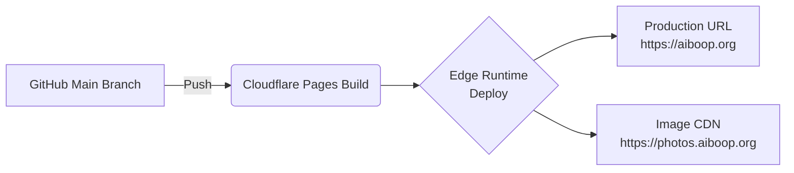

# 📘 [System Requirement Specification] 이루리 소개팅 (Iluli Dating)  
**문서 버전**: `2.0.0` (Reverse Engineered & Modernized)  
**최종 수정일**: `2025-11-27`  
**상태**: ✅ **확정 (Approved)**  

> **핵심 원칙**  
> *"본 문서는 개발 팀과 AI의 유일한 진실 공급원(Source of Truth)입니다. 모든 구현은 여기에 정의된 내용을 준수해야 합니다."*

---

## 1. 개요 (Introduction)
### 1.1 목적 (Purpose)
- '이루리 소개팅' 웹 애플리케이션의 **기술적 요구사항**, **시스템 아키텍처**, **API 인터페이스**, **데이터 로직**을 명시화
- 개발 일관성 보장을 위한 단일 참조 문서 (Single Source of Truth)

### 1.2 범위 (Scope)
| 항목 | 내용 |
|------|------|
| **서비스명** | 이루리 소개팅 (Iluli Dating) |
| **핵심 기능** | 1:1 매칭, 프로필 탐색, 사진 좋아요, 인스타그램 ID 교환 |
| **운영 환경** | Cloudflare Pages (Edge Runtime) |

### 1.3 용어 정의 (Definitions)
| 용어 | 설명 |
|------|------|
| **Active User** | 관리자 승인 완료 → 매칭 풀(Pool)에 노출되는 사용자 |
| **Pending User** | 가입 완료 후 관리자 승인 대기 중인 사용자 |
| **Matching** | 쌍방 호감(Mutual Like) 확인 → 상호 인스타그램 ID 공개 상태 |

---

## 2. 시스템 아키텍처 (System Architecture)
### 2.1 기술 스택 (Tech Stack) - **Latest Stable Versions Required**
| 구분 | 기술 / 라이브러리 | 버전 / 비고 |
|------|-------------------|-------------|
| **Framework** | Next.js | v15+ (App Router) |
| **Library** | React | v19+ |
| **Language** | TypeScript | v5.x |
| **Styling** | Tailwind CSS | v4.0+ |
| **Database** | Cloudflare D1 (SQLite) | Prisma ORM v6.x |
| **Storage** | Cloudflare R2 | S3 Compatible API |
| **Auth** | Auth.js (NextAuth) | v5.0 (Beta/Stable) |
| **Infra** | Cloudflare Pages | Pages Functions (Edge Runtime) |

### 2.2 인프라 및 배포 파이프라인


### 2.3 환경 변수 (Configuration)
| 변수명 | 설명 | 예시 |
|--------|------|------|
| `DATABASE_URL` | Prisma D1 커넥터 | `file:./dev.db` |
| `AUTH_SECRET` | 세션 암호화 키 | `openssl rand -base64 32` |
| `AUTH_GOOGLE_ID` | OAuth Client ID | - |
| `AUTH_GOOGLE_SECRET` | OAuth Client Secret | - |
| `ADMIN_EMAILS` | 관리자 이메일 화이트리스트 | `admin@aiboop.org,dev@test.com` |
| `NEXT_PUBLIC_R2_URL` | R2 퍼블릭 액세스 도메인 | `https://photos.aiboop.org` |

---

## 3. 기능 요구사항 명세 (Functional Requirements)
### 3.1 회원 및 프로필 (User & Profile)
#### **FR-01: 사용자 온보딩**
- **로직**: 구글 OAuth 로그인 시 User 테이블 조회. 미존재 시 `PENDING` 상태로 생성
- **중요 제약**: 필수 정보(학교, 인스타ID 등) 미입력 시 `/profile/edit` 외 모든 페이지 접근 차단 (Middleware 제어)

#### **FR-02: 프로필 유효성 검증** (`lib/validations.ts`)
```typescript
// 닉네임: 1~15자, 특수문자 금지
/^[가-힣a-zA-Z0-9]{1,15}$/

// 학교명: 2~15자, 특수문자 금지
^[가-힣a-zA-Z0-9]{2,15}$

// 인스타그램 ID: 영문/숫자/_/. 허용
/^[a-zA-Z0-9._]{1,30}$/

// 졸업여부: Boolean (UI: Dropdown Yes/No)
// 자기소개: 최대 300자 (Textarea)
```

#### **FR-03: 사진 업로드 (Direct Upload)**
- **플로우**:  
  `Client → POST /api/upload` (URL 요청) → `Server` (Pre-signed URL 발급) → `Client` (PUT R2)
- **파일 규격**:  
  - 최대 10MB (클라이언트/서버 이중 검증)  
  - 지원 포맷: `jpg`, `png`, `webp`, `avif`, `heic`, `heif`, `jxl`  
- **경로 전략**:  
  `{userId}/{timestamp}-{uuid}.{ext}`

---

### 3.2 매칭 및 탐색 (Matching & Discovery)
#### **FR-04: 매칭 후보 추천 알고리즘** (`GET /api/matches/candidates`)
- **필터링 로직**:
  ```javascript
  1. 성별 필터: User.gender !== Me.gender
  2. 상태 필터: User.status === 'ACTIVE'
  3. 차단 필터: Block 테이블에 (Me→Target) 또는 (Target→Me) 기록 없음
  4. 히스토리 필터: Like 또는 Pass 기록이 없는 유저 (단, Reset 시 Pass 기록 무시)
  ```
- **정렬 우선순위**:  
  🥇 **Priority 1**: 나를 이미 좋아한 유저 (`Like 테이블에 toUserId === Me 존재`)  
  🥈 **Priority 2**: 무작위 셔플
  
- **Empty State 처리**:  
  후보 없음(404) 시 "다시 찾기(Reset)" 버튼 제공 → `POST /api/matches/reset` 호출 후 PASS 기록 초기화

#### **FR-05: 상호작용** (`POST /api/matches/action`)
| 파라미터 | 값 | 효과 |
|----------|-----|------|
| `action` | `LIKE` | 상대방이 이미 나를 좋아했으면 **매칭 성사** |
| `action` | `PASS` | 다음 후보로 이동 (히스토리 기록) |
| **매칭 성사 시**: | `Match 테이블 생성` + `isMatch: true` 응답 + 상대 인스타ID 공개 |

#### **FR-06: 사진 좋아요** (`POST /api/photos/[id]/like`)
- **역공학 핵심 발견**:  
  - 특정 사진에 대한 '좋아요'를 수행
  - 유저에 대한 LIKE와 별개로 동작하거나, 유저 LIKE의 트리거가 될 수 있음
  - **권장 구현**: 사진 좋아요 시 해당 유저에게도 관심 표현으로 간주

---

### 3.3 어드민 및 보안 (Admin & Security)
#### **FR-07: 관리자 대시보드**
- **접근 제어**: `session.user.email`이 `ADMIN_EMAILS` 환경변수에 포함된 경우만 접근 허용
- **엔드포인트**: 
  - `GET /api/admin/users`
  - `GET /api/admin/photos`
- **핵심 기능**:
  ```markdown
  ✅ 신규 가입 유저(PENDING) 승인 처리 (ACTIVE로 변경)
  ✅ 신고 누적 유저 확인 및 제재(BANNED)
  🚫 부적절한 사진 강제 삭제
  ```

#### **FR-08: 신고 및 차단**
| 기능 | 엔드포인트 | 동작 | 처리 방식 |
|------|------------|------|-----------|
| **신고** | `POST /api/reports` | 신고 사유와 함께 접수 | 즉시 제재 없음 → 관리자 승인 큐에 적재 |
| **차단** | `POST /api/blocks` | 상대방을 차단 리스트에 추가 | 즉시 상호 간 탐색 불가 처리 |

---

## 4. API 인터페이스 명세
### 4.1 Public & User API
| Method | Endpoint | 설명 | Request Body / Query | 비고 |
|--------|----------|------|----------------------|------|
| `GET` | `/api/users/me` | 내 정보 조회 | - | - |
| `PUT` | `/api/users/me` | 프로필 수정 | `{ nickname, school, ... }` | 유효성 검사 필수 |
| `GET` | `/api/matches/candidates` | 매칭 후보 조회 | `?limit=10` | 우선순위 정렬 적용 |
| `POST` | `/api/matches/action` | 유저 좋아요/패스 | `{ targetUserId, action }` | 매칭 여부 반환 |
| `POST` | `/api/matches/reset` | 후보 재설정 | - | PASS 기록 초기화 |
| `POST` | `/api/photos/[id]/like` | 사진 좋아요 | - | 코드 역공학 발견 |
| `POST` | `/api/upload` | 업로드 URL 발급 | `{ filename, filetype }` | Presigned URL |
| `POST` | `/api/reports` | 유저 신고 | `{ targetId, reason }` | - |
| `POST` | `/api/blocks` | 유저 차단 | `{ targetId }` | - |

### 4.2 Admin API (`/admin/*`)
| Method | Endpoint | 설명 | Request Body | 권한 |
|--------|----------|------|--------------|------|
| `GET` | `/api/admin/users` | 전체/대기 유저 조회 | `?status=PENDING` | Admin |
| `PATCH` | `/api/admin/users` | 유저 상태 변경 | `{ userId, status }` | Admin |
| `DELETE` | `/api/admin/photos` | 사진 강제 삭제 | `{ photoId }` | Admin |

---

## 5. 데이터 모델 (Prisma Schema)
```prisma
model User {
  id          String     @id @default(cuid())
  status      UserStatus @default(PENDING) // ACTIVE, BANNED
  role        Role       @default(USER)    // USER, ADMIN
  
  // Profile
  nickname    String?
  school      String?
  instagramId String?
  isGraduated Boolean    @default(false)
  
  // Relations
  sentLikes     Like[]   @relation("Sender")
  receivedLikes Like[]   @relation("Receiver")
  matches       Match[]
  reports       Report[]
  blocks        Block[]
}

model Like {
  id        String   @id @default(cuid())
  fromId    String
  toId      String
  isSuper   Boolean  @default(false) // 사진 좋아요 등
  createdAt DateTime @default(now())
  
  @@unique([fromId, toId])
}

// Match, Photo, Report, Block models follow standard patterns
```

---

## ⚠️ **Critical Edge Runtime Constraints**
| 분야 | 필수 준수 사항 |
|------|----------------|
| **보안** | • 모든 민감 정보 → 환경변수만 사용<br/>• `ADMIN_EMAILS` 화이트리스트 엄격 검증 |
| **성능** | • Prisma 쿼리에 `status`/`gender` 인덱스 필수<br/>• R2 업로드 10MB 제한 이중 검증 |
| **호환성** | • **절대 금지**: `fs`, `path`, `crypto` 등 Node.js 모듈<br/>• **대체**: `fetch`, `Request`, `Response` (Web Standards) |
| **i18n** | • 모든 UI 텍스트 → `messages/*.json`에서 관리<br/>• 페르시아어(`fa`) 지원 시 논리적 속성(`ms-4`, `pe-2`) 적용 |