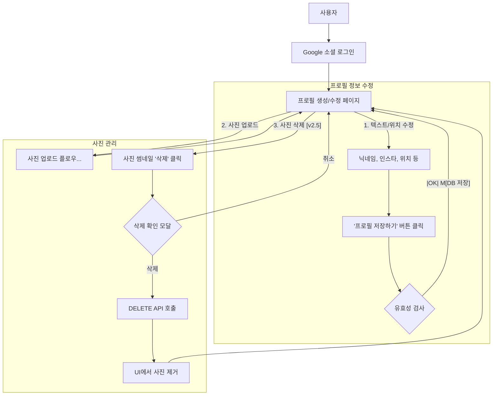

-----

# [PRD-USER-001] 내 프로필 관리 (사진, 정보, 위치)

**문서 버전:** **2.5** (사진 삭제 기능 추가) | **작성일:** 2025-11-16 | **작성자:** 이루리 (AI)
**Epic:** `EPIC-001` (사용자 프로필 및 온보딩) | **스토리 포인트:** 20 (18 + 2) | **우선순위:** **High**

## 1\. 개요

  - **User Story**:

    1.  (사진 인증) "사용자로서 내 폰의 포토부스 사진을 업로드하고, **'인증 신청'** 을 통해 관리자 승인을 받고 싶다. 그래서 **'인증 배지'** 와 **'매칭 우선권'** 을 얻고 싶다."
    2.  (프로필 수정) "사용자로서 내 프로필 수정 페이지에서 닉네임, 학교, MBTI, 자기소개 및 **내 인스타그램 계정 URL**을 등록/수정하고 싶다."
    3.  (위치 등록) "사용자로서, 서비스 이용에 필요한 **내 기본 위치 정보를 등록/업데이트하고 싶다.** 그래서 '가까운 거리 순' 정렬(`PRD-USER-003`)을 받고 싶다."
    4.  **(사진 삭제) [v2.5 추가]** "사용자로서, 내가 원하지 않거나 실수로 올린 사진을 **내 프로필에서 영구적으로 삭제하고 싶다.** 그래서 내 프로필을 항상 내가 원하는 상태로 관리하고 싶다."

  - **Acceptance Criteria (Gherkin Format)**:

<!-- end list -->

```gherkin
Feature: 프로필 사진 파일 업로드 및 인증
  (시나리오 생략: v2.4와 동일 - 사진 업로드, 인증 신청)

Feature: 내 프로필 정보 수정 (인스타그램, 위치 포함)
  (시나리오 생략: v2.4와 동일 - 인스타그램 URL, 위치 정보 등록/검증)

Feature: 내 프로필 사진 삭제 [v2.5 추가]
  시나리오: 사용자가 자신의 사진을 성공적으로 삭제한다.
    Given 나는 '프로필 수정' 페이지에 있으며, 내가 업로드한 '사진 A'가 보인다.
    When 내가 '사진 A' 썸네일의 '삭제' 아이콘(휴지통)을 클릭한다.
    And "이 사진을 정말 삭제하시겠습니까?"라는 확인 모달(Modal)에서 '삭제'를 클릭한다.
    Then '사진 A'가 내 프로필 그리드에서 즉시 사라져야 한다 (Optimistic UI).
    And 서버로 `DELETE /api/v1/profile/photos/{photoId}` 요청이 전송된다.
    And `ProfilePhotos` 테이블에서 해당 레코드가 삭제된다.
    And (`Likes` 테이블에서 해당 `photoId`와 연관된 모든 '좋아요' 레코드가 (DB Cascade) 삭제된다.)
    And (`R2` 스토리지에서 해당 이미지 파일이 삭제된다. (비동기 처리 가능))

  시나리오: 사용자가 사진 삭제를 취소한다.
    Given 내가 '사진 A'의 '삭제' 버튼을 클릭했다.
    When "이 사진을 정말 삭제하시겠습니까?" 모달에서 '취소'를 클릭한다.
    Then 아무 일도 일어나지 않고, 모달이 닫히며 '사진 A'는 삭제되지 않는다.
```

## 2\. 사용자 흐름 (User Flow - 프로필 수정)



## 3\. 상세 기능 명세

### 3.1 UI/UX 요구사항

  - **화면 목록: 프로필 생성/수정 페이지**
    1.  **'내 정보' 섹션 (Form)**:
          - (v2.4와 동일: 닉네임, 인스타, 위치 정보, 저장 버튼)
    2.  **'내 사진' 섹션 (Grid)**:
          - (기존) '사진 업로드' 버튼, 업로드된 사진 목록 (썸네일)
          - (기존) 인증 배지 및 인증 버튼
          - **(삭제) [v2.5 추가]**: 각 사진 썸네일 모서리에 \*\*'삭제' 아이콘 (휴지통 모양)\*\*을 표시합니다.
    3.  **'삭제 확인' 모달 (신규) [v2.5 추가]**:
          - `Title`: "사진 삭제"
          - `Body`: "이 사진을 정말 삭제하시겠습니까? 이 사진과 관련된 모든 '좋아요' 내역이 함께 사라지며, 복구할 수 없습니다."
          - `Buttons`: [취소] (기본), [삭제] (붉은색/주의)

### 3.2 데이터 요구사항

  - **입력값 검증 (Client-side & Server-side)**:
      - (v2.4와 동일: MIME Type, File Size, Instagram URL, Location)
  - **데이터 모델 (Cloudflare D1 - SQLite 기반)**:
      - `Users`: (변경 없음)
      - `UserProfiles`: (v2.4와 동일 - `geohash` 포함)
      - `ProfilePhotos`: (변경 없음 - `likes_count` 포함)
  - **API (신규)**:
      - **`DELETE /api/v1/profile/photos/{photoId}` [v2.5 추가]**
          - **목적**: `photoId`에 해당하는 사진을 `ProfilePhotos` 테이블에서 삭제합니다.
          - **권한**: 인증된 사용자(`auth.userId`)가 `ProfilePhotos.user_id`와 일치할 때만 삭제를 허용해야 합니다.

## 4\. 성능 요구사항

  - (v2.4와 동일: 업로드, 저장, GPS 속도)
  - **사진 삭제**: 1초 이내 API 응답. (R2 파일 삭제는 비동기 처리 권장)

## 5\. 보안 요구사항

  - (v2.4와 동일: 파일 검증, 권한 검증, URL 검증, 위치 동의)
  - **(삭제 권한) [v2.5 추가]**: `DELETE /.../{photoId}` API는 **사진의 소유권(Ownership)** 을 D1 쿼리의 `WHERE` 절 (`...WHERE id = ? AND user_id = ?`)에 명시하여, 인증된 사용자가 본인 사진만 삭제할 수 있도록 강제해야 합니다.

## 6\. AI 에이전트 구현 가이드 (GitHub Copilot)

### Copilot 프롬프트 예시 (Cloudflare Worker + React):

```
Feature: Update User Profile (Info, Photos, Delete)
Tech Stack: Cloudflare Workers, Hono (TS framework), D1, R2, React, TypeScript, Axios
Files to Create/Modify:
- functions/api/profile/index.ts (Worker: PATCH update profile)
- functions/api/profile/upload.ts (Worker: POST upload)
- functions/api/profile/photos/[id]/index.ts (Worker: DELETE handler) [v2.5 New]
- src/pages/ProfileEdit.tsx (React Page Component)
- src/components/profile/DeleteConfirmationModal.tsx (React Component) [v2.5 New]
- schema.sql (D1 Schema - v2.4/v2.5)

Constraints (Backend - Profile Info):
  - (v2.4 동일: PATCH /profile 핸들러, geohash 계산 로직)
  
Constraints (Backend - Photo Delete) [v2.5 New]:
- 'functions/api/profile/photos/[id]/index.ts' (DELETE):
  - Must be a DELETE handler.
  - Must use Auth middleware.
  - Must verify ownership: 'DELETE FROM ProfilePhotos WHERE id = ?1 AND user_id = ?2'
  - (R2 파일 삭제는 이 API 응답과 별개로 비동기(e.g., Queue) 처리 권장)
- 'schema.sql':
  - `Likes` 테이블의 `photo_id` Foreign Key에 `ON DELETE CASCADE`를 추가하여 사진 삭제 시 '좋아요'가 자동 삭제되도록 설정 (PRD-USER-004 Tech Spec에서 확정 필요).

Constraints (Frontend - ProfileEdit.tsx) [v2.5 New]:
- Each photo in the grid must have a 'Delete' icon button.
- Clicking 'Delete' must open the 'DeleteConfirmationModal'.
- On modal confirmation, call a new 'deletePhoto(photoId)' API function.
- Use Optimistic UI: On API call success, filter the photo out of the local state.
```

## 7\. 의존성 및 선행 작업

  - **선행 작업 (기술)**:
      - (v2.4와 동일: Google OAuth, R2, D1 스키마 v2.4 적용)
      - **`PRD-ADMIN-001`**: 관리자 사진 승인 페이지 개발
  - **의존성 (수정 필요)**:
      - **`PRD-USER-004 Tech Spec` (수정 필요)**: `PRD-USER-004`에서 정의할 `Likes` 테이블의 `photo_id` 외래 키(Foreign Key)에 **`ON DELETE CASCADE`** 옵션을 추가해야 합니다. 이 옵션이 없으면 사진을 삭제할 때 D1에서 외래 키 제약 조건 오류가 발생합니다.

## 8\. 성공 지표 (KPI)

  - (v2.4와 동일: 프로필 완성도, 인증 신청률, 인스타/위치 등록률)
  - **사진 삭제율 [v2.5 추가]**: (월간 삭제된 사진 수) / (월간 업로드된 사진 수) (콘텐츠 관리 건전성 지표)

-----
